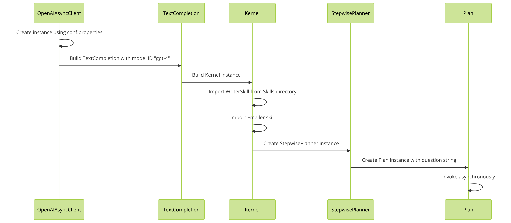

# SemanticKernel-Basics

## Project Description

SemanticKernel-Basics is a project that demonstrates the usage of the Semantic Kernel Planner. The Semantic Kernel Planner is a powerful tool that utilizes Azure OpenAI's capabilities to perform semantic planning.

## Setup

To get started with the project, follow these steps:

1. Clone the repository to your local machine.
2. Copy the file `conf.properties.example` to `conf.properties` (located in the `src/main/resources` directory).
3. Update the `client.azureopenai.key` and `client.azureopenai.endpoint` properties with your Azure OpenAI key and URL respectively. These credentials are required to access the Semantic Kernel Planner API.

The main class to demo the Semantic Kernel Planner is `DemoStepwiseplanner`. This class provides a comprehensive demonstration of the planner's capabilities and showcases its usage in various scenarios.

## Explanation

The `DemoStepwisePlanner` class is a comprehensive demonstration of the Semantic Kernel Planner's capabilities. It showcases how to create an instance of `OpenAIAsyncClient`, build a `TextCompletion` instance, and import skills from a directory. It also demonstrates how to create a `StepwisePlanner` instance, create a `Plan` instance, and invoke it asynchronously. 

In addition, the `DemoStepwisePlanner` class includes inner classes `Emailer` and `ResultDisplayServer` that demonstrate how to retrieve an email address for a given user name, send an email with a subject, message, and email address, and display the email content in a browser.

